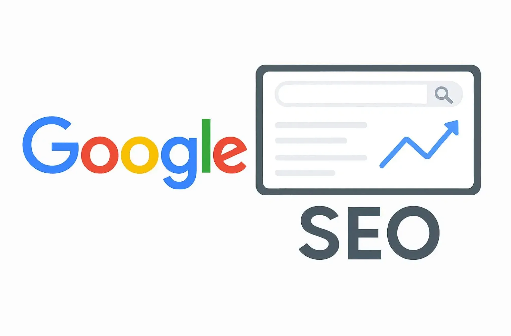
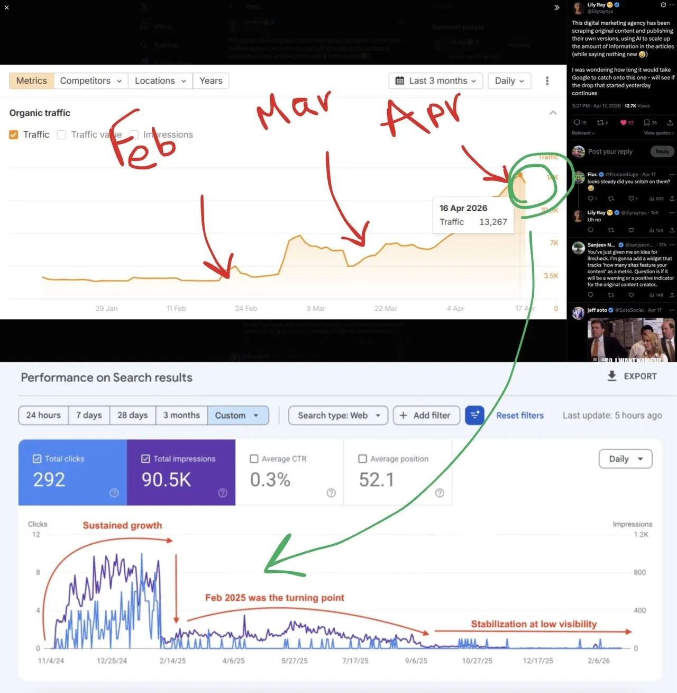

最近在 LinkedIn 上看到一段讨论，关于 AI 内容当前在 Google 搜索引擎中的处境。

观点不少，争议挺多。有人说 Google 会惩罚 AI 内容，有人说不一定。吵来吵去，核心问题反而被模糊了——Google 到底怎么看这件事？

有些观点值得说清楚。

### 三个事实

**事实一：Google 不歧视 AI 内容本身。**

没有证据表明 Google 会因为是 AI 生成的就降权。问题从来不是”谁写的”，而是”写得好不好”。输出质量、价值密度、内容结构、发布策略——这些才是决定因素。

**事实二：Google 能识别 AI 内容。**

词频分布、句式模式，这些特征藏不住。但”能识别”和”会惩罚”是两回事。能看出来，不代表会动手。

**事实三：AI 内容容易被判定为”低努力”。**

什么情况下会被打上这个标签？三种：突然大规模发布，域名历史上从没这么干过；域名缺乏基础信任度；背后没有品牌背书。这三种情况叠加，AI 内容就成了可疑信号。

### 问题不在生成方式

回到原点：AI 输出的是什么？文字。只有文字。

那图片呢？视频呢？多媒体内容呢？这些东西能支撑文章、提升体验，但 AI 内容往往只有大段文本。光这一点，就输了半截。

还有一个问题： **AI 内容是在创造新价值，还是在重复已有内容？**

这才是要害。Google 不需要在搜索结果里放 10 篇说同样话的文章。如果全网已经有 10000 个站点在讲同一件事，你的内容又没有增量价值，那 Google 根本不需要索引——更别提排名了。

### 同质化陷阱

这引出一个更大的问题：内容同质化。

当所有人都用 AI 生成内容，而 AI 又倾向于输出”最可能的回答”，结果就是大规模的内容雷同。Google 面对的是：同样的观点、同样的结构、同样的论据、同样的结论。

这种情况下，索引谁不索引谁？排名谁不排名谁？

Google 的选择很明确： **不需要索引重复内容** 。

### 怎么破？

两条路。

**一条路：做 AI 做不了的事。**

原创数据、一手采访、独特视角、个人经验——这些是 AI 难以生成的。用 AI 做”骨架”，用人填”血肉”，才是正解。

**另一条路：承认 AI 的边界。**

AI 擅长的是整理、归纳、表达清晰。不擅长的是突破、原创、带来新东西。把 AI 当工具，不是当替代。

### 最后

Google 不讨厌 AI 内容，Google 讨厌的是没有价值的内容。

AI 时代，这个判断标准反而更清晰了： **你是在创造，还是在制造噪音？**

答案决定了你的页面是被索引，还是被自动忽略。
