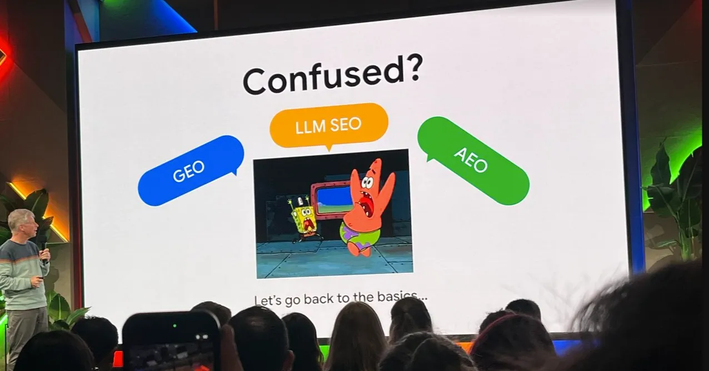
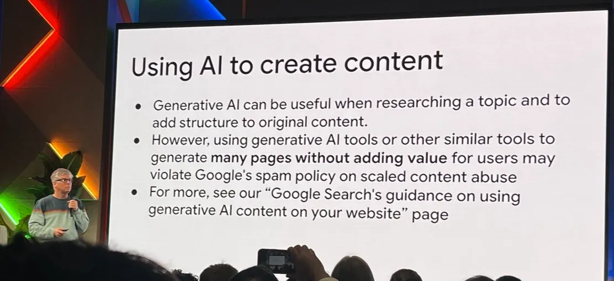
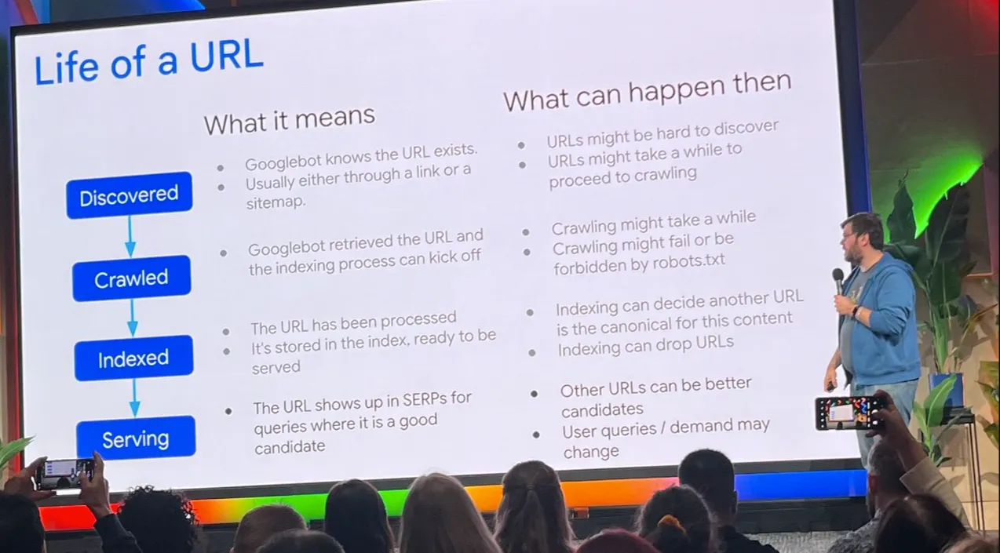
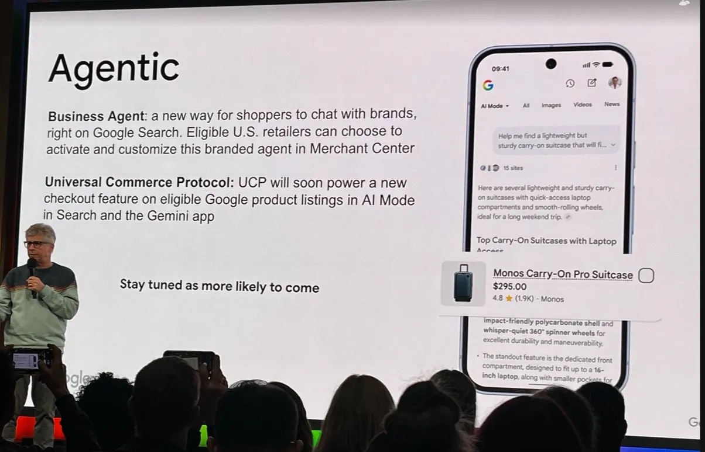
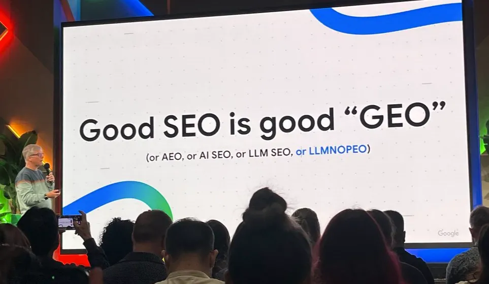
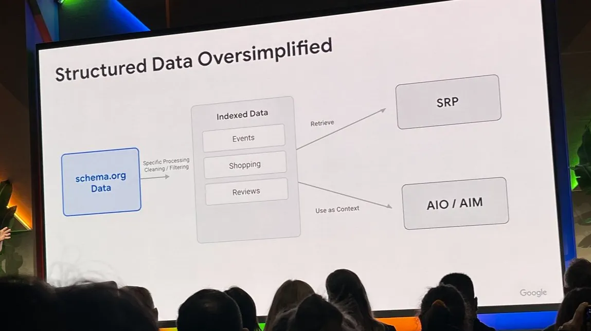

2026 年 4 月，Google 在多伦多举办首次加拿大 Search Central Live。官方展示的大量的幻灯片透露的并不是「新概念」，而是对现有认知的修正。

## 一、索引机制：门槛在升高，不是降低

AI 降低创作门槛，反向推高索引门槛。

Google 不再「来者不拒」，而是通过 **Selective Indexing** 主动选择哪些页面值得索引。内容容易生产 ≠ 内容容易被索引。这也意味着：内容工厂模式正在失效。规模化生产如果没有规模化价值，就会触发算法惩罚。AI 加速了内容生产，也加速了垃圾识别。

### 引用要点

已抓取——目前尚未被编入索引「Crawled – Currently not indexed」状态出现时，质量问题占大头（内容「不够好」、重复内容、canonical 冲突），技术问题只占少数（404、重定向、robots.txt）。

诊断优先级：先查质量，再查技术。

### 流量下降的归因纠正

AI 内容流量下降，常被归因于「用了 AI」。但 Google 的算法逻辑是：

> **Scaled Content Abuse 算法** 针对的是「规模化产出」，不是「AI 产出」。内容复用不添加分析或上下文，构成 Scaled Content Abuse，若多个域名展现相似垃圾模式时，Google 可能将其视为单一网络施加惩罚。

流量下降的触发条件：

- 大量产出相似内容 → 触发规模化筛选
- 零互动信号 + 算法排名 = 潜在惩罚触发
- 与是否使用 AI 无直接关联

诊断方法：检查内容生产模式是否规模化，而非是否使用 AI。若确认存在 Scaled Content Abuse 问题，恢复需要内容整合，而非逐页优化。

---

## 二、AI Overview：fanouts 绕过了 bot 阻止

很多人以为阻止 Google-Extended bot 就能阻止内容进入 AI Overview，这是误解。

### fanouts 与 grounding 的技术逻辑

一个提问触发 8-12 个并行子查询——即 fanouts。AI 通过它多角度交叉验证，综合输出答案。grounding 是 fanouts 的锚点——将生成内容「锚定」到可验证网页。没有它，AI「凭空说话」；有了它，每句回答有据可查。

> 可以理解为 fanouts 是「尽职调查」，grounding 是「来源锚点」。两者共同决定了谁能出现在 AI 回答中。

**Google 的运作逻辑：**

1. 内容进入搜索索引 → 你已同意这个基础
2. AIO 生成时，Google 通过 **fanouts** 调用索引数据
3. Google-Extended 只影响「grounding 和链接」，不影响「数据使用」

> **阻止 Google-Extended 的结果** ：失去引用/链接，但信息本身仍被使用。

### 数据洞察

- 95% 的 fanout 查询在传统关键词工具中搜索量为零
- AI Overviews 覆盖约 47% 的 Google 搜索
- 96% 的 AIO 引用携带 E-E-A-T 信号
- AI 偏好 40-60 字的「原子化答案块」

### data nosnippet 的唯一有效性

目前真正阻止特定内容被 AI 使用的方式只有一种：

> data nosnippet 是唯一有效阻止方式。

代价：这是一把双刃剑。阻止内容被 AI 使用的同时，可能减少传统 SEO 效益（如 snippet 展示）。

### Agentic Search 的适用范围

Agentic Search 的高级功能目前主要适用于电商领域。其他领域的 **User Centric Productivity (UCP)** 之外，暂无高级 agentic 功能机会。

---

## 三、Trends API：一致缩放解决了痛点

API 更新让跨时间维度数据可比较。即将到来的 Trends API 更新解决了一个长期痛点：不同时间维度的数据无法统一比较。

### 新能力

| 功能 | 说明 |
|---|---|
| 多搜索词查询 | API 支持不同搜索词批量查询 |
| 多时间维度 | 支持日、周、月三种维度 |
| 一致缩放 | 结果按统一比例缩放，可跨维度比较 |

### Trends vs Keyword Planner 的区别

两者计算方式不同：

- **Trends** ：跨平台兴趣（YouTube + Search）、「Breakout」查询识别
- **Keyword Planner** ：搜索量预测、广告规划

Trends 数据滞后 48 小时，目的是防止垃圾邮件发送者利用实时数据。

---

## 四、SEO 误区：两件事被官方证伪

Markdown 转换和 llms.txt 对 SEO 无价值。

两个流行的「LLM 优化」做法，被 Google 直接回应：

| 做法 | 官方回应 |
|---|---|
| 将网站转换为 Markdown | 对 LLM 或 SEO 没有好处 |
| 创建 llms.txt 文件 | 对 SEO 没有好处 |

> Google 的索引和处理机制不依赖这些格式。

这意味着：内容优化应回归 SEO 本质（质量、结构、用户体验），而非追逐「LLM 专用格式」。

### Danny Sullivan 的论断

Google 搜索联络官 Danny Sullivan 重申：「 **SEO for AI is still SEO** 」。

AI 搜索使用的排名信号与传统搜索一致。GEO (Generative Engine Optimization) 不是新学科，而是 SEO 的子集。那些宣称「AI 改变一切」的说法，要么是误解，要么是营销。

在 AI 搜索时代，SEO 从业者无需学习新框架。原有技能组合——关键词研究、意图对齐、技术优化、内容质量——仍然是成功的基础。AI 工具可用于内容起草，但人工审核不可省略，E-E-A-T 信号在 AI 搜索中权重更高，同时长尾查询将成为 AI 引用的主战场。

---

## 五、待填补空白：AIO 追踪无时间表

AI Overview 追踪报告正在开发，但无发布时间。AI Overview 和 AI Mode 的追踪数据是目前 SEO 的空白区域。

Google 团队确认：

- 正在开发 AIO 追踪功能
- **未提供时间表**

这意味着：目前无法量化 AIO 对流量的影响，只能通过其他方式推测。

### Structured Data 的新机会点

Rich Results Testing Tool 与通用 Schema Testing App 的区别：

> **Rich Results Testing Tool** 接入 Google 内部索引栈，通用工具不具备。

测试可信度差异：前者更接近 Google 实际处理逻辑。

新用例探索方向：电商领域的 Structured Data 应用（活动明确提到值得探索）。

---

## 六、Gemini 的「塑造」差异

AI Overview、AI Mode、Gemini App 使用同一模型，但输出不同。Google Search 对 Gemini 的「塑造」方式不同于独立应用，不要用 Gemini App 的表现来判断 AI Overview 的表现。

---

## 总结：五个认知更新

| 认知维度 | 更新内容 |
|---|---|
| 索引门槛 | AI 降低创作门槛 → Google 反向提高索引门槛 |
| 流量归因 | 流量下降源于「规模化」而非「AI」 |
| AIO 阻止 | Google-Extended 无效 → data nosnippet 是唯一方式 |
| API 能力 | Trends API 支持一致缩放，跨维度可比较 |
| SEO 误区 | Markdown 转换和 llms.txt 无 SEO 价值 |

这些更新并没有颠覆现有 SEO 逻辑，但修正了几个流行误解。

---

## 行动框架：从诊断到执行

基于本次 Search Central Live Toronto 活动的公开内容，得出如下结论：

> 话题集群优于单页关键词优化。FAQ Schema 使页面被 AI 引用的概率提升 60%。AI 模型会「学会」信任早期信源，先发优势明显。被 AI 引用的品牌往往在多个平台同时出现。

这里有一套可执行的行动框架：

- **诊断优先**。检查 Search Console 中的索引错误，识别零流量页面，审查 E-E-A-T 信号完整性。问题通常在质量层而非技术层。
- **内容升级**。关键词思维升级为话题集群思维。使用 Q&A 格式标题，在段落开头放置 40-60 字的原子化答案块——这是 AI 引用的「入口」。
- **技术与信号**。实施 FAQ Schema（可使页面被 AI 引用的概率提升约 60%），确保移动端加载速度，配置 data-nosnippet 保护敏感信息。建立作者档案页、添加专家审核标记、引用一手来源、展示信任徽章，这些是 AI 引用的「入场券」。

AI 搜索时代的优化是系统性工程。诊断、内容、技术、信号协同，才能建立可持续的可见性。
